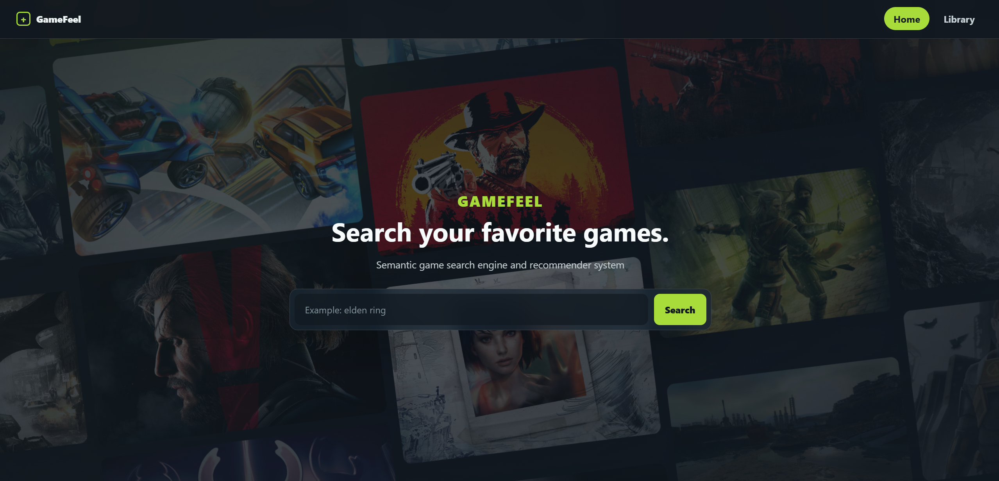
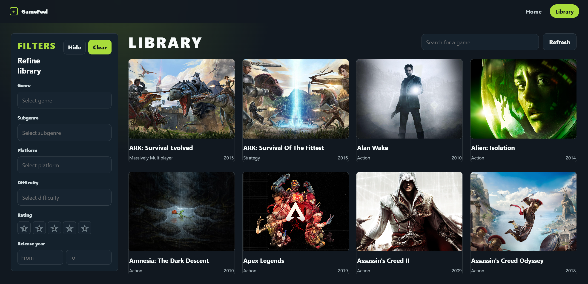
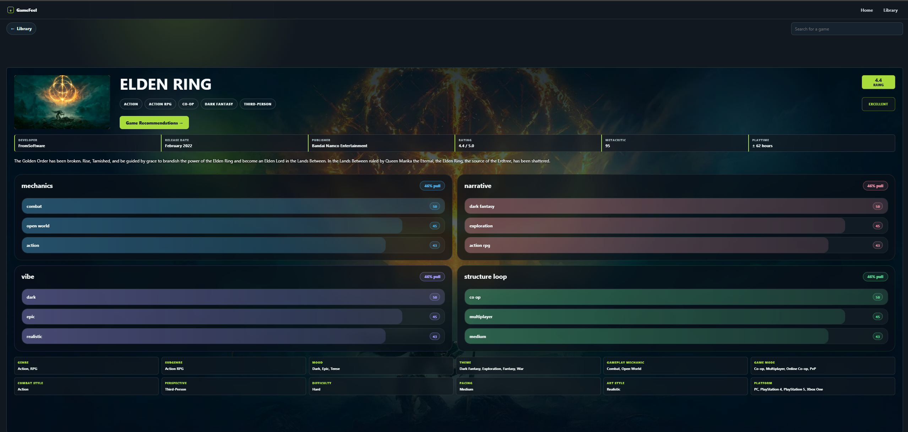
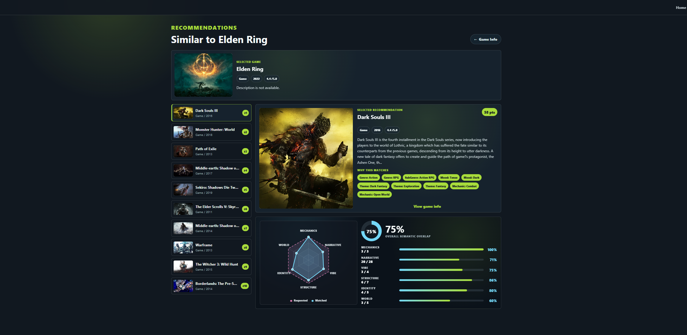

# GameFeel KG

GameFeel KG adalah aplikasi rekomendasi game berbasis Semantic Web. Sistem membaca data RDF melalui SPARQL/Fuseki, lalu menampilkan rekomendasi yang dapat dijelaskan berdasarkan kemiripan atribut semantik seperti genre, mood, theme, mechanic, game mode, difficulty, pacing, platform, dan tag.

## Struktur Project

- `apps/web`: frontend React + TypeScript + Vite.
- `apps/api`: backend Express + TypeScript, Prisma staging, dan integrasi SPARQL.
- `data/raw/rawg_games.json`: data mentah dari RAWG.
- `data/curated/gamefeel_dataset.csv`: dataset curated untuk RDF.
- `ontology/gamefeel_ontology.ttl`: ontology GameFeel.
- `rdf/gamefeel_data.ttl`: data RDF/Turtle.
- `sparql`: query SPARQL untuk search, detail, dan rekomendasi.
- `docs/examples`: folder untuk screenshot contoh hasil.

## Panduan Instalasi

1. Install kebutuhan utama:
   - Node.js 20+
   - pnpm
   - Java JDK 17+
   - Apache Jena Fuseki

2. Cek requirement environment:

```bash
cat requirements.txt
```

3. Jalankan setup dependency project:

Windows PowerShell:

```powershell
powershell -ExecutionPolicy Bypass -File requirements.ps1
```

macOS/Linux:

```bash
bash requirements.sh
```

4. Salin environment jika `.env` belum dibuat otomatis:

```bash
cp .env.example .env
```

5. Jalankan Apache Jena Fuseki di `http://localhost:3030`, lalu buat dataset bernama `GameFeel`.

6. Upload ontology dan RDF ke Fuseki:

```bash
pnpm fuseki:reload
```

7. Jalankan aplikasi:

```bash
pnpm dev
```

Frontend berjalan di Vite, sedangkan API berjalan pada port `3000` secara default.

## Contoh Hasil

Letakkan screenshot hasil aplikasi di folder `docs/examples`. Gambar akan otomatis tampil di README jika nama filenya sesuai.

| Halaman | Preview |
| --- | --- |
| Home |  |
| Library |  |
| Game Info |  |
| Recommendations |  |
| SPARQL Search |  |
| SPARQL Detail |  |
| SPARQL Recommendation |  |
